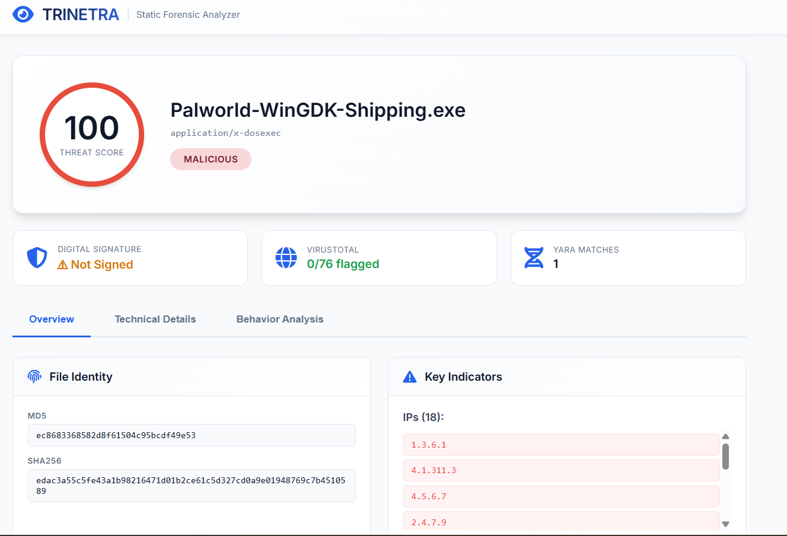

# 👁️ TRINETRA | Universal Static Forensic Analyzer


> **"Unveil the Unseen."**  
> Trinetra (Third Eye) is a powerful, open-source static analysis engine designed to dissect suspicious files without executing them.

---

### [🚀 Live Demo](https://trinetra-4nih.onrender.com/) | [⭐ Star on GitHub](https://github.com/PushkarPisolkar04/Trinetra)

---

## ✨ Key Features

- **🔍 Universal File Support**: Analyzes Executables (EXE/DLL), Android Apps (APK), Documents (PDF/Docx), Archives (ZIP), and Images.
- **🧠 Chitragupta AI Engine**: Heuristic scoring system that calculates a "Threat Score" based on entropy, imports, and anomalies.
- **🛡️ Deep PE & APK Forensics**: Inspects headers, permissions, manifest details, and digital signatures.
- **🧬 YARA Intelligence**: Built-in support for advanced YARA rules to detect Spyware, Ransomware, and Anti-Analysis techniques.
- **🌐 Network Intelligence**: Automatically extracts IPs, URLs, and Domains to hunt for C2 infrastructure.
- **⚡ Blazing Fast**: Purely static analysis means results in seconds, not minutes.
- **🎨 Modern Dashboard**: A sleek, professional web interface with real-time multi-stage analysis progress.

---

## 📸 Screenshots



---

## 🛠️ Installation & Usage

### ⚙️ Configuration
1. Rename `config.example.py` to `config.py`.
2. Add your **VirusTotal API Key** (optional).

### 🚀 Quick Start
```bash
# Clone the repository
git clone https://github.com/PushkarPisolkar04/Trinetra.git
cd Trinetra

# Install dependencies
pip install -r requirements.txt

# Run the app
python web_app.py
```
> Access at: `http://127.0.0.1:5000`

---

## 🤝 Contributing

We love open source! Feel free to:
1. **Fork** the repo.
2. Create a **Feature Branch**.
3. Open a **Pull Request**.

**[PushkarPisolkar04/Trinetra](https://github.com/PushkarPisolkar04/Trinetra)**

---

**Disclaimer**: This tool is for educational and defensive purposes only. The authors are not responsible for misuse.